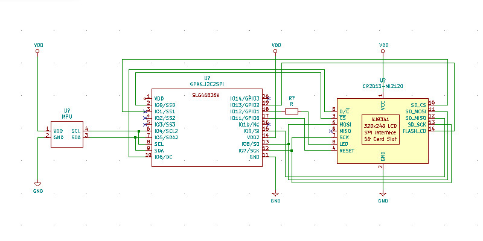
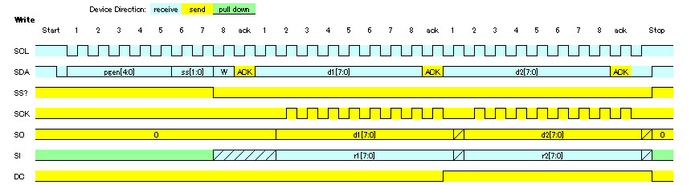
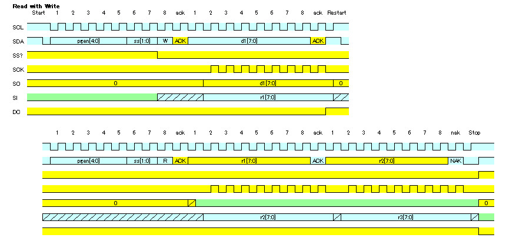

# I2C-to-SPI bridge and GPIO extender using GreenPAK. (緑豆壱拾陸號)
  
GreenPAK用のデザインデータです。  
I2CインタフェースからSPIに対応したデバイスへのアクセスを可能にします。  
同時にGPIOを追加することもできます。  
SLG46826V(STQFN) または SLG46826G(TSSOP) に対応しています。   
- update at 2020/7/14 I2Cアドレス可変版(I2C2SPI-A)を追加リリースしました。

## 機能
- I2Cアドレスで最大4つのSPIデバイスの選択アクセスが可能
- アドレスを指定してリードするタイプのSPIデバイスに対応
- 一部のLCD特有の4線式SPIインタフェースに対応
- 一部のLCD特有のデータ端子の双方向通信に対応
- SPIに加え、4つのGPIO端子が利用可能
- I2C端子に約10kΩのプルアップ抵抗を内蔵
- SPIのSI,SO端子に約100kΩのプルダウン抵抗を内蔵
- GPIO端子に約100kΩのプルアップ抵抗を内蔵
  
### 本デザインの使用イメージ
パスコンは省略してあります。  
  
  
## ピンアサイン
SLG46826のI2C端子とSPI制御用のI2C端子は別の端子になっています。  
I2Cアドレスも独立しています。  
通常はSCLとSCL2、SDAとSDA2をつないでお使いください。  
データ端子で双方向通信を行うデバイスとつなぐときは、SO端子に数kΩの抵抗を挟んでつないでください。  
  
### I2C2SPI （I2Cアドレス固定版）
STQFN Pin # | TSSOP Pin # | 機能名 | IO | 内蔵抵抗 | SLG46826端子名 | 機能
--- | --- | --- | --- | --- | --- | ---
1 | 20 | VDD |  |  | VDD |  2.3V～5.5V
2 | 19 | SS0 | O | - | IO0 | SPI ch0 Select, active low
3 | 18 | SS1 | O | PU10k | IO1 | SPI ch1 Select, active low
4 | 17 | SS2 | O | - | IO2 | SPI ch2 Select, active low
5 | 16 | SS3 | O | - | IO3 | SPI ch3 Select, active low
6 | 15 | SCL2 | I | PU10k | IO4 | I2C SCL for SPI
7 | 14 | SDA2 | I/O | PU10k | IO5 | I2C SDA for SPI
8 | 13 | SCL | I | - | SCL | SCL for SLG46826
9 | 12 | SDA | I/O | - | SDA | SDA for SLG46826
10 | 11 | DC | O | - | IO6 | data / command select for LCD
11 | 10 | GND |  |  | GND |  GND
12 | 9 | SCK | O | - | IO7 | Serial Clock Output
13 | 8 | SDO | I/O | PD100k | IO8 | Serial Data Output (or Input)
14 | 7 | VDD2 |  |  | VDD2 |  2.3V～5.5V
15 | 6 | SDI | I | PD100k | IO9 | Serial Data Input
16 | 5 | NC | - | PU10k | IO10 | Do Not Connect (internal use)
17 | 4 | GPIO0 | I/O | PU100k | IO11 | general-purpose input/output 0
18 | 3 | GPIO1 | I/O | PU100k | IO12 | general-purpose input/output 1
19 | 2 | GPIO2 | I/O | PU100k | IO13 | general-purpose input/output 2
20 | 1 | GPIO3 | I/O | PU100k | IO14 | general-purpose input/output 3

### I2C2SPI-A （I2Cアドレス可変版,差分のみ）
STQFN Pin # | TSSOP Pin # | 機能名 | IO | 内蔵抵抗 | SLG46826端子名 | 機能
--- | --- | --- | --- | --- | --- | ---
4 | 17 | SLA0 | I | PD100k | IO2 | I2C address Select
5 | 16 | SLA1 | I | PD100k | IO3 | I2C address Select
19 | 2 | GPIO2/SS2 | I/O | PU100k | IO13 | general-purpose input/output 2 or SPI ch2 Select, active low
20 | 1 | GPIO3/SS3 | I/O | PU100k | IO14 | general-purpose input/output 3 or SPI ch3 Select, active low

### 内蔵抵抗
各端子の内蔵抵抗を有効にしてありますので、外付けプルアップ／プルダウン抵抗を省略できます。  
記号はおおよその抵抗値を表しており、値は以下の通りです。  
- PU10k: Pull-up 10k ohm  
- PD100k Pull-down 100k ohm  
- PU100k Pull-up 100k ohm  
  
## SPIデバイスの選択
SPIデバイスの選択は、I2Cアドレスの下位2ビット([1:0])で行います。  
上位5ビット([6:2])はコンフィギュレーションレジスタで変更することができます。  
(設計ツール上でPGENのデータを書き換えてもかまいません)  
デフォルト値におけるSS0～SS3とデバイスアドレスとの対応は以下の通りです。  
  
SS | select bit | default | hex
--- | --- | --- | --- 
SS0 | xxxxx00 | 1010100 | 0x54
SS1 | xxxxx01 | 1010101 | 0x55
SS2 | xxxxx10 | 1010110 | 0x56
SS3 | xxxxx11 | 1010111 | 0x57
  
## コンフィギュレーションレジスタ
### I2C2SPI （I2Cアドレス固定版）
I2Cアドレス固定版では、コンフィギュレーションで使用するI2Cアドレスは、0x08～0x0Fです。  
※I2Cアドレスを変更するには設計ツールでI2Cのプロパティを書き換えてください。  
I2Cアドレス0x08のI2Cレジスタを書き換えることでデバイスの動作を制御できます。  
I2Cアドレス0x09~0x0Fは回路書換用に予約されていますので、不用意にアクセスを行わないでください。  
  
### I2C2SPI-A （I2Cアドレス可変版,差分のみ）
I2Cアドレス可変版では、端子SLA1,SLA0をHighまたはLowとすることでコンフィギュレーションで使用するI2Cアドレスを選択することができます。  
SLA1,SLA0とI2Cアドレスの対応は以下の通りです。  
I2Cアドレスの下位3ビットをオール0にすることで、コンフュギュレーションレジスタにアクセスすることができます。  
オール0以外は回路書換用に予約されていますので、不用意にアクセスを行わないでください。  
※上位2ビットは固定です。変更するには設計ツールでI2Cのプロパティを書き換えてください。  
  
SLA1 | SLA0 | binary | hex | comment
--- | --- | --- | --- | ---
open | open | 0100xxx | 0x20 0x21~0x27 | for configuration reserved 
Low  | Low  | 0100xxx | 0x20 0x21~0x27 | for configuration reserved 
Low  | High | 0101xxx | 0x28 0x29~0x2F | for configuration reserved 
High | Low  | 0110xxx | 0x30 0x31~0x37 | for configuration reserved 
High | High | 0111xxx | 0x38 0x38~0x3F | for configuration reserved 
  
### コンフィギュレーションレジスタ一覧
レジスタ一覧を下記に示します。  
  
address | W/R | default| bit | Definition 
--- | --- | --- | ---| ---
0x92 | W | 0x0B | [7:5] | *Reserve*
　 | | | [4:1] | *I2C address[5:2] for SPI function* | 
　 | | | [0] | *I2C address[6] for SPI function* | 
0x9A | W | 0x58 | [7:0] | *SO timing* 0x58: SPI mode 0 or 2, 0x78: SPI mode 1 or 3
0x9B | W | 0x13 | [7:0] | *SCK polarity* 0x13: SPI mode 0 or 1, 0x03: SPI mode 2 or 3
0x13 | W | 0x85 | [7:0] | *Bidirectional SO support for reading* 0x85:read by SI, 0x75:read by SO
0xC8 | W | 0x00 | [7:0] | *Software reset* 0x02: Reset
0x42 0x43 0x44 | W | 0xB2 0x3D 0xDF | [7:0] [7:0] [7:0] | *GPIO2/SS2, GPIO3/SS3 pin funtion select* 0xB2,0x3D,0xDF: GPIO2, GPIO3 0xCF,0x3F,0xDF: SS2, GPIO3 0xB2,0x0D,0xFD: GPIO2, SS3 0xCF,0x0F,0xFD: SS2, SS3
0x7A | W | 0x00 | [7:4] | *GPIO direction control* 0:input, 1:output [7]:GPIO3 [6]:GPIO2 [5]:GPIO1 [4]:GPIO0
　 | | | [3:0] | *GPIO output value* 0:Low, 1:High [3]:GPIO3 [2]:GPIO2 [1]:GPIO1 [0]:GPIO0
0x75 | R | -- | [7:6] | *Reserve* 
　 |  |  | [5] | *GPIO3 input value* 0:Low, 1: High | 
　 |  |  | [4] | *GPIO2 input value* 0:Low, 1: High | 
　 |  |  | [3] | *GPIO1 input value* 0:Low, 1: High | 
　 |  |  | [2] | *GPIO0 input value* 0:Low, 1: High | 
　 |  |  | [1:0] | *Reserve* | 
    
### SPIモード
電源投入後にコンフィギュレーションレジスタのアドレス0x9A,0x9Bを書き換えることで、SPIの動作モードを切り替えることができます。  
設定は全てのSPI端子で共通です。  
使い分けが必要な場合は、SPIライトまたはリードの前にその都度レジスタを設定してください。  
SPIのデフォルトはモード0です。  
  
本デバイスで想定しているSPIモードの一覧を示します。  
  
  
### LCD対応
一部のLCDのSPIインタフェースにはデータとコマンドを区別するためのDC端子もしくはRS端子が追加されています。  
本デバイスのDC端子はこの端子と接続することを意図しています。  
DC端子からはデータ出力の2バイト目でLowからHighになる信号が出力されます。  
  
また、データ端子が双方向になっているものもあります。    
データリード時にデータ端子が出力に切り替わるデバイスに対応するには、SO端子に数kΩの抵抗を挟んでつないでください。  
また、コンフィギュレーションレジスタのアドレス0x13の設定を行ってください。  
使い分けが必要な場合は、SPIリードの前にその都度レジスタを設定してください。  

### GPIO
コンフィギュレーションレジスタを設定またはリードすることで、GPIOを用いた入出力を行えます。  
用途としては、LCDのリセット端子や抵抗を挟んでLED端子などにつないで制御することを想定しています。  
GPIOのデフォルトは全端子入力かつ100kΩプルアップ状態です。  
また、GPIO2,GPIO3はそれぞれSS2,SS3に切り替えて使用することもできます。  
必要に応じてコンフィギュレーションレジスタのアドレス0x42、0x43、0x44を設定してください。  
  
### ソフトウェアリセット
コンフィギュレーションレジスタのアドレス0xC8に0x02を書き込むことで、SLG46826にリセットをかけることができます。  
リセット後はSLG46826が初期化され、端子設定やSPI動作モードなどが初期状態に戻ります。  
  
## タイミングチャート
I2CフォーマットとSPIフォーマットの間の基本的なタイミングチャートを紹介します。
  
### ライト
タイミングチャートは以下の通りです。  
   
***chips***  
*１バイトライトにおいて、ライト中の受信データを読み出したいときは、使用していないSPIデバイスを指定して下記のフォーマットで１バイトリードを実行すると。無駄なデータ送信なしにデータをリードすることが可能です。*  
  
### リード
リードを単体で実行することができます。
リードデータの1バイト目に前回アクセス時の最後の受信データが、2バイト目から新規アクセス時の受信データを順にリードできます。  
タイミングチャートは以下の通りです。  
  
  
### アドレス指定リード
SPIデバイスの多くはリード前にアドレス指定が必要ですので、こちらのフォーマットでリードアクセスしてください。  
ライトデータにはアドレスなどのSPIへの送信データを指定し、リピーティッドスタートでリードを行います。
リードデータの1バイト目にライト時の受信データが、リードデータの2バイト目からライト後の受信データを順にリードできます。  
タイミングチャートは以下の通りです。  
  
  
## 設計データ
「GreenPAK6 Designer」で  
I2C2SPI.gp6  または　I2C2SPI-A.gp6  
を開き、SLG46826Vに焼いてください。  
プルアップ／プルダウン抵抗、ドライブ能力などはお好きに変更して下さい。
SLG46826G に焼く場合は、File-Project info で Packageを「TSSOP-20」に変更してください。  
  
## 免責事項
当方は、利用者に対して、このデザインおよびこの資料（以下、本デザイン等）に関する当方または第三者が有する著作権、特許権、商標権、意匠権及びその他の知的財産権をライセンスするものではありませんし、本デザイン等の内容についていかなる保証をするものでもありません。また当方は、本デザイン等を用いて行う一切の行為について何ら責任を負うものではありません。本デザイン等の情報の利用、内容によって、利用者にいかなる損害、被害が生じても、当方は一切の責任を負いません。ご自身の責任においてご利用いただきますようお願いいたします。   
  
  
## Author  
[GitHub/AoiSaya](https://github.com/AoiSaya)  
[Twitter ID @La_zlo](https://twitter.com/La_zlo)  
